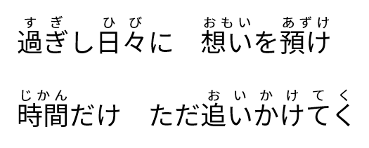
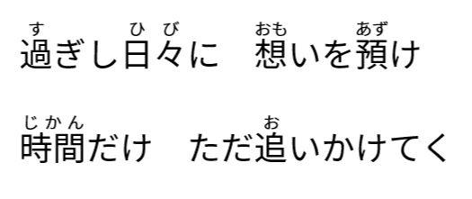
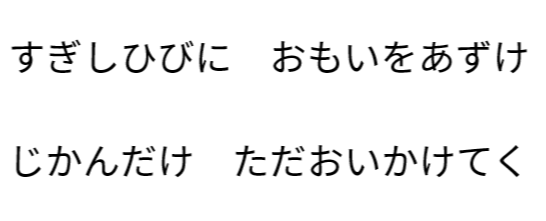

#  Lyrics Helper

This is a utility processing ruby text in document files,

especially useful for Japanese lyrics.

## What it can

- Cleaning ruby text.　
- Stripping out ruby text.

<figure>
    
    <figcaption>Original</figcaption>
</figure>
<figure>
    
    <figcaption>Cleaned</figcaption>
</figure>
<figure>
    
    <figcaption>Stripped</figcaption>
</figure>

## What it can't (yet)

- To *generate* ruby text.
- To support multilingual. ***You can help!***
- To process documents not created by Microsoft® Word. ***You can help!***
